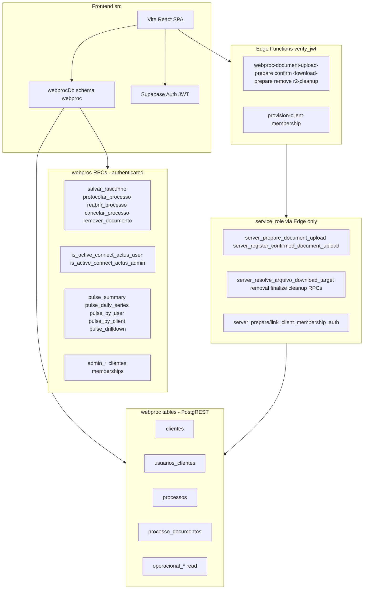

# WebProc Production Infrastructure — PROD-INFRA.1

**Gate date:** 2026-10-02  
**PO approval:** 2026-10-02 — **PROD-INFRA.1 CLOSED / PASS**; **PROD-INFRA.1a CLOSED / PASS**  
**RC baseline:** `58f7e04e6fe64f6c6da8269d8414cfbe6dcd1f8d`  
**Status:** Infrastructure / migration readiness documented — **production NOT declared ready.**  
**No production Supabase project, R2 bucket, or deploy was created in this slice.**

---

## Executive result

| Question | Answer |
|----------|--------|
| Can **all 28** repository migrations apply on an **empty** Supabase database without pre-existing legacy `public` objects? | **NO** |
| Can the **current WebProc runtime** database be reproduced from repository artifacts on greenfield? | **YES**, by applying the **WebProc migration subset** (`20260307180000` → latest) only — not the three `202510*` legacy-prefix migrations. |
| Are legacy `public.t_processoweb` objects required at **runtime** by `src/` or WebProc Edge? | **NO** (historical migration artifacts + generated types only). |

**Recommended strategy:** **Strategy B — Production baseline / selective migration apply** (see § Migration production strategy).

**Live greenfield proof (PROD-INFRA.1a):** **EXECUTED** (2026-10-02) on **local** Supabase (`127.0.0.1:54322`). DEV cloud **`cxrnptygbzqzobtdxpwo`** not reset (`--linked` never used).

| Step | Evidence |
|------|----------|
| Full 28-chain reset | **FAIL** at `20251002135826` — `relation "public.t_processoweb" does not exist` (SQLSTATE 42P01) |
| Strategy B WP-01+ reset | **PASS** — **25** migrations applied (`20260307180000` → `20261002130100`) |
| Legacy objects | `to_regclass('public.t_processoweb')` = **null**; FK to legacy public = **0** |
| Schemas | `webproc`, `webproc_private` present |
| Tables | **9** in `webproc` (core + operational) |
| RPCs (`webproc`) | **38** functions; required lifecycle/Pulse/admin/server RPCs verified present |
| RLS | **enabled** on all 9 `webproc` tables; **11** policies |
| Triggers | **11** non-internal on `webproc` |
| History repair (local) | `migration repair --local --status applied` on `20251002135826`, `20251006143435`, `20251007145916` → `db push --local --dry-run` **up to date** |
| Future migration drill | Temp `20261002184642_prod_infra_1a_future_proof.sql` applied via `db push --local` only; legacy still absent; file **removed**; history **reverted** for test version |

**Strategy B live classification:** **PASS** (local greenfield).

**DEV architecture compare:** Read-only DEV introspection via MCP was **inconclusive** (empty/timeout; DEV `schema_migrations` head includes versions **not** in this repo snapshot). Greenfield proof validates **repository WP-01+ contract**; DEV is expected to match WebProc objects already exercised on RC — formal DEV↔greenfield diff remains **REQUIRED-BEFORE-PROD** on staging link if MCP/SQL access differs.

---

## Migration inventory (28 files, chronological)

| Version | File (prefix) | Purpose | Schemas / major objects | Legacy `public.*` | Classification |
|---------|---------------|---------|-------------------------|-------------------|----------------|
| 20251002135826 | `2afb3939…` | Drop overly permissive RLS on legacy process tables | Policies on `public.t_processoweb`, `public.t_docsprocessos` | **Requires tables to exist** | **LEGACY-DEPENDENT**, **NOT-RUNTIME-RELEVANT** |
| 20251006143435 | `30486cae…` | Legacy Supabase Storage bucket `process-attachments` | `storage.buckets`, `storage.objects` policies | None (storage only) | **GREENFIELD-SAFE** if reached, **NOT-RUNTIME-RELEVANT** (WebProc uses R2) |
| 20251007145916 | `ea72797b…` | Legacy upload metadata table | `public.arquivos_enviados` → FK `public.t_processoweb` | **Requires `t_processoweb`** | **LEGACY-DEPENDENT**, **NOT-RUNTIME-RELEVANT** |
| 20260307180000 | wp01 | Greenfield WebProc core schema | `webproc.*` core tables, RLS, grants | None | **GREENFIELD-SAFE** |
| 20260307190000 | wp01c | Membership `nome` column | `webproc.usuarios_clientes` | None | **GREENFIELD-SAFE** |
| 20260307200000 | wp01d | Same-client membership SELECT helper | `webproc_private`, RLS policy | None | **GREENFIELD-SAFE** |
| 20260307210000 | wp02 | Draft save, links, protocolization RPCs | `webproc` RPCs, triggers | None | **GREENFIELD-SAFE** |
| 20260307220000 | wp02a | Reopen, dt_fatal rules | `webproc` RPCs | None | **GREENFIELD-SAFE** |
| 20260307230000 | wp02a.1 | Authoritative `salvar_rascunho` | RPC replace | None | **GREENFIELD-SAFE** |
| 20260307240000 | wp02b.1 | Operational evidence tables | `webproc.operacional_*` | None | **GREENFIELD-SAFE** |
| 20260307250000 | wp02b.2 | Operational domain functions | `webproc_private` recorders | None | **GREENFIELD-SAFE** |
| 20260307260000 | wp02b.3 | Lifecycle + operational read RPCs | `webproc` RPCs | None | **GREENFIELD-SAFE** |
| 20260307270000 | wp02b.4 | SECURITY DEFINER boundary fix | `webproc_private` privileges | None | **GREENFIELD-SAFE** |
| 20260307280000 | wp03 | Document domain, server RPCs, RLS column grants | `webproc.processo_documentos`, `webproc.server_*`, `webproc_private.*` | None | **GREENFIELD-SAFE** |
| 20260307290000 | wp03b | Actus internal users + read RLS | `webproc.usuarios_actus` | None | **GREENFIELD-SAFE** |
| 20260307300000 | wp03 2B | Secure download authorization RPC | `webproc` download RPC | None | **GREENFIELD-SAFE** |
| 20260329120000 | wp04a | `is_active_connect_actus_user` wrapper | `webproc` RPC | None | **GREENFIELD-SAFE** |
| 20260329140000 | wp04c | Pulse read layer | `pulse_*` RPCs | None | **GREENFIELD-SAFE** |
| 20260329153000 | wp04a3b | Admin domain CRUD RPCs | `admin_*` RPCs | None | **GREENFIELD-SAFE** |
| 20260329160000 | wp04a3c1 | Auth provision server RPCs (service_role) | `server_prepare/link_client_membership_auth` | None | **GREENFIELD-SAFE** |
| 20260930160000 | wp04b0 | Admin capability probe | `is_active_connect_actus_admin` | None | **GREENFIELD-SAFE** |
| 20260930180000 | proto_dom1 | Identification XOR enforcement | CHECK + RPC updates | None | **GREENFIELD-SAFE** |
| 20260930200000 | proto_dom1a | GRANT XOR helper to `authenticated` | EXECUTE grant | None | **GREENFIELD-SAFE** |
| 20261001150000 | proto_gov1 | Mandatory cancel reason | `webproc.processos` columns + RPC | None | **GREENFIELD-SAFE** |
| 20261001163000 | pulse_dom1 | Fatal attention counts | `pulse_summary` replace | None | **GREENFIELD-SAFE** |
| 20261001170000 | pulse_dom1a | Active-status fatal alignment | `pulse_summary` replace | None | **GREENFIELD-SAFE** |
| 20261002120000 | proto_doc3 | Coordinated removal + R2 cleanup state | RPCs, `r2_cleanup_pending` | None | **GREENFIELD-SAFE** |
| 20261002130100 | proto_doc3 grant | Column SELECT on `r2_cleanup_pending` | GRANT | None | **GREENFIELD-SAFE** |

**Dependency chain:** WebProc migrations depend on Supabase platform schemas (`auth.users`, `storage` where used) and prior WebProc files in timestamp order. They do **not** depend on legacy `public.t_processoweb` when the `202510*` trio is omitted.

**Data-dependent behavior:** RPC `INSERT` paths inside function bodies are operational templates, not migration-time seed data. No migration inserts production tenant or Auth user fixtures.

**Destructive behavior:** Legacy migrations drop policies (non-destructive to WebProc). WebProc migrations use forward-only `CREATE OR REPLACE` / additive DDL.

---

## Legacy prefix — evidence (20251002135826, 20251007145916, 20251006143435)

### 20251002135826

- **Expects:** `public.t_processoweb`, `public.t_docsprocessos` with named RLS policies.
- **Created in repo migrations?** **No.** Stub documented in `supabase/reference/legacy_public_baseline_local.sql` (local validation only).
- **Required by current WebProc runtime?** **No** — `src/` never queries these tables; only stale entries in generated `types.ts` `public` section.
- **Superseded later?** WebProc document/process model lives entirely in `webproc` (WP-01+).
- **Empty DB failure:** **Yes** — PostgreSQL `DROP POLICY … ON public.t_processoweb` errors if the relation does not exist (`IF EXISTS` applies to the policy name, not the table).
- **WebProc without it?** **Yes.**

### 20251007145916

- **Expects:** `public.t_processoweb(id_proc)` for FK on `public.arquivos_enviados`.
- **Created in repo migrations?** **No** (same reference stub).
- **Runtime?** **No** — legacy attachment path; WebProc uses `webproc.processo_documentos` + R2 Edge.
- **Empty DB without parent table:** **Fails** on FK creation.
- **WebProc without it?** **Yes.**

### 20251006143435

- **Creates:** Storage bucket `process-attachments` + RLS on `storage.objects`.
- **Runtime?** **No** — legacy Edge (`upload-attachment`, `list-attachments`, `delete-attachment`) not invoked from `src/`.
- **Greenfield:** Succeeds on empty Supabase **if** this migration runs; in full chain it never runs because **20251002135826 fails first**.

---

## Current runtime dependency graph (RC)



### A — Current WebProc runtime (required for prod)

| Layer | Objects |
|-------|---------|
| **Tables (direct)** | `webproc.clientes`, `webproc.usuarios_clientes`, `webproc.processos`, `webproc.processo_documentos`; Pulse/Actus filters also read `clientes`, `usuarios_clientes`; operational UI reads `operacional_*` (SELECT grants) |
| **RPCs (authenticated)** | Lifecycle + draft: `salvar_rascunho`, `protocolar_processo`, `reabrir_processo`, `cancelar_processo`, `remover_documento`; probes: `is_active_connect_actus_user`, `is_active_connect_actus_admin`; Pulse: `pulse_*`; Admin: `admin_*` |
| **Edge** | `webproc-document-upload-prepare`, `webproc-document-upload-confirm`, `webproc-document-download-prepare`, `webproc-document-remove`, `webproc-document-r2-cleanup`, `provision-client-membership` |
| **Private (not PostgREST-exposed)** | `webproc_private.*` helpers; accessed via SECURITY DEFINER RPCs and Edge `service_role` |

### B — Bootstrap / admin (post-migration ops)

- Insert `webproc.usuarios_actus` (ADMIN) linked to Auth user UUID.
- `admin_create_cliente` + `admin_create_client_membership` → `provision-client-membership` Edge → Auth invite → `/auth/activate`.
- Not present in migration SQL as fixed identities.

### C — Legacy / historical (not runtime)

- `public.t_processoweb`, `public.t_docsprocessos`, `public.arquivos_enviados`
- Storage bucket `process-attachments`
- Edge: `list-attachments`, `upload-attachment`, `delete-attachment`

### D — Test / harness only

- `supabase/reference/*.sql`, `legacy_public_baseline_local.sql`, dev smoke scripts

---

## Greenfield test (this slice)

| Mechanism | Result |
|-----------|--------|
| `supabase db reset` / `supabase start` | **Blocked** — Docker Desktop Linux engine not running |
| DEV cloud | **Not used** (per gate) |
| Static analysis | **First failure:** `20251002135826` — missing `public.t_processoweb` |
| Local reference | `legacy_public_baseline_local.sql` explicitly documents manual pre-application of legacy stubs **before** chronological migrations for local WP-02B validation only |

**Reproducible from zero (full 28-file chain):** **NO**  
**Reproducible from zero (WebProc subset, 25 migrations from WP-01):** **YES** (expected; pending live dry-run when Docker available)

---

## Migration production strategy — **Strategy B**

**Recommendation:** **Strategy B — Production baseline / selective apply**

1. **Existing DEV** keeps full `supabase_migrations` history (all 28 versions). Do **not** rewrite applied migrations.
2. **New production (and staging greenfield)** apply only migrations with timestamp **`>= 20260307180000_wp01_webproc_schema.sql`**, skipping the three `202510*` files as **non-runtime historical artifacts**.
3. **Future migrations** continue to use forward timestamps; both DEV and prod receive the same new files via normal `db push` / CI.
4. **Optional PROD-INFRA.1a:** Add an authoritative runbook + CI job that (a) runs `supabase db reset` on empty local, (b) applies WP-01+ subset or documents CLI flags, (c) fails if legacy prefix reintroduced without guard.

**Not recommended now:** Strategy C (edit `202510*` in place) — risks DEV/history drift and provides no runtime benefit.

**Strategy A** (full chain unchanged) is **invalid** for empty DB without external legacy DDL.

### Legacy migrations skipped on greenfield prod (Strategy B baseline)

| Version | Reason skipped |
|---------|----------------|
| `20251002135826` | RLS policy drops on `public.t_processoweb` / `t_docsprocessos` — tables not created in WebProc lineage |
| `20251006143435` | Legacy Storage bucket `process-attachments` — not used by WebProc R2 path |
| `20251007145916` | `public.arquivos_enviados` FK to legacy `t_processoweb` |

**WP-01+ chain (apply on greenfield):** `20260307180000` through latest repository migration (**25 files** as of RC `58f7e04`; re-count before prod cutover).

---

## PROD-INFRA.1a — Strategy B execution proof

**Status:** **CLOSED / PASS** (PO approval 2026-10-02). **Live local proof PASS.**

**Mechanism:** Three `202510*.sql` files moved to gitignored `.tmp/prod-infra-legacy-migrations/` → `npx supabase db reset` (local) → files restored → `migration repair --local` for skipped legacy versions → future-migration drill → cleanup (28 repo files unchanged in git).

**When Docker is available — local proof procedure (repository-safe):**

1. Confirm local only: `npx supabase status` shows local URLs/ports; do **not** pass `--linked`.
2. **Optional full-chain witness:** `npx supabase db reset` with all 28 files present → expect failure at `20251002135826` (`relation "public.t_processoweb" does not exist`). Do not create legacy stubs.
3. **Strategy B apply (isolated):**
   - Move the three `202510*.sql` files to a **gitignored** temp dir (e.g. `.tmp/prod-infra-legacy-migrations/`) — **not** a commit; restore before finishing.
   - `npx supabase db reset` (local) → applies WP-01+ only.
   - Restore the three files to `supabase/migrations/`.
   - Run verification SQL below.
4. **Optional history-alignment drill (local only):** After step 3, mark skipped versions in **local** history so a subsequent `db push` would not re-apply legacy SQL:
   - `npx supabase migration repair --local --status applied 20251002135826 20251006143435 20251007145916`
   - Confirm `supabase_migrations.schema_migrations` contains all **28** versions with WP-01+ actually executed and legacy three marked applied without SQL.
5. **Future migration drill (local):** Add a **gitignored** temp file under `.tmp/` (not `supabase/migrations/`), or use `supabase migration new` then `repair --status reverted` cleanup — prove only pending repo migrations run. Remove temp artifacts; **never commit** test migrations.
6. `npx supabase stop` when finished (optional).

**Post-apply verification queries (run on local DB via `psql` or Studio SQL):**

```sql
-- Schemas
SELECT schema_name FROM information_schema.schemata
WHERE schema_name IN ('webproc', 'webproc_private');

-- Core tables
SELECT table_schema, table_name FROM information_schema.tables
WHERE table_schema = 'webproc'
ORDER BY table_name;

-- Legacy must be absent (Strategy B)
SELECT to_regclass('public.t_processoweb') AS t_processoweb,
       to_regclass('public.arquivos_enviados') AS arquivos_enviados;

-- Sample RPC presence
SELECT p.proname FROM pg_proc p
JOIN pg_namespace n ON n.oid = p.pronamespace
WHERE n.nspname = 'webproc'
  AND p.proname IN (
    'salvar_rascunho', 'protocolar_processo', 'pulse_summary',
    'is_active_connect_actus_user', 'admin_list_clientes',
    'server_prepare_document_upload'
  )
ORDER BY 1;

-- RLS enabled on core tenant tables
SELECT c.relname, c.relrowsecurity
FROM pg_class c JOIN pg_namespace n ON n.oid = c.relnamespace
WHERE n.nspname = 'webproc'
  AND c.relname IN ('processos', 'processo_documentos', 'clientes', 'usuarios_clientes');
```

**WP-01+ SQL must not reference legacy tables:** confirmed by repository grep (only `202510*` migrations touch `public.t_processoweb`).

---

## Production Strategy B runbook (executable — no credentials)

**Prerequisites:** Empty **new** Supabase project (PO/Actus); Supabase CLI logged in; project linked to **staging/prod ref only** (never DEV `cxrnptygbzqzobtdxpwo` for baseline experiments unless explicitly staging); Docker for local rehearsal optional.

| Step | Action | Abort if |
|------|--------|----------|
| 1 | Create empty Supabase project (Dashboard) | — |
| 2 | Link CLI: `supabase link --project-ref <PROD_OR_STAGING_REF>` | Wrong ref |
| 3 | **Apply WP-01+ SQL** to empty DB using one of: (A) CI job that runs migration files `>= 20260307180000` in order via `psql`/`supabase db execute`; (B) local proof copy pipeline pushing to linked empty project with legacy files temporarily excluded from apply set | Any migration error |
| 4 | **Align migration history** so legacy files are not pending: `supabase migration repair --linked --status applied 20251002135826 20251006143435 20251007145916` on the **new** project only | Repair against DEV |
| 5 | Verify history head matches repo: compare `supabase migration list` / `schema_migrations` to latest WP file timestamp | Missing versions |
| 6 | Dashboard → API → expose schema **`webproc`** | `PGRST106` in app |
| 7 | Run verification SQL (§ above) on linked DB | Missing RPC/RLS |
| 8 | Set Edge secrets; deploy 6 WebProc functions + `provision-client-membership` | Before WP-03+ on DB |
| 9 | R2 bucket + CORS for prod origin | Before document smoke |
| 10 | Auth redirect URLs + SMTP (PO) | Before invite smoke |
| 11 | Bootstrap ADMIN (operational — PROD-BOOTSTRAP.1) | — |

**Why step 4 is required:** `supabase db push` applies every migration file whose version is **not** recorded in `supabase_migrations.schema_migrations`. After WP-01+ apply, the three legacy versions are still **absent** from history unless marked **`applied`** via `migration repair`. Marking them **applied without running SQL** is intentional on greenfield prod: legacy objects are not part of WebProc runtime and must not be created.

**DEV coexistence:** DEV retains real applied history for all 28 (including legacy). **Never** run repair to mark legacy as applied on DEV unless those migrations truly ran (they did on DEV).

**Rollback / abort:** Before bootstrap, delete project or restore from empty snapshot; do not partial-repair production history without DBA review.

**Future migrations:** After steps 3–5, new files in `supabase/migrations/` with timestamps after repo head apply normally via `supabase db push` — legacy trio remain satisfied in history.

---

## Fresh schema completeness (WP-01+ chain)

Repository-controlled WP-01+ migrations define:

| Concern | Covered in migrations |
|---------|------------------------|
| Schemas | `webproc`, `webproc_private` |
| Core domain tables | `clientes`, `usuarios_clientes`, `processos`, `processo_documentos`, `usuarios_actus`, `operacional_*` |
| Enums / CHECK | Status checks, XOR, cancel reason, document types, etc. |
| Indexes / FKs | Per WP-01–WP-03, PROTO-DOC.3 |
| RPCs / triggers | Lifecycle, Pulse, Admin, document server wrappers |
| RLS | Enabled on tenant tables; Actus read policies WP-03B |
| Grants | `authenticated` table/RPC/column grants; `service_role` on server RPCs |
| `webproc_private` | Not API-exposed; EXECUTE via definer wrappers |

**Not in migrations (manual / platform):**

- Supabase Dashboard: **expose schema `webproc`** in Data API settings (TD Deployment Portability MUST).
- Auth SMTP, redirect URLs, Edge secrets (see contracts below).
- R2 bucket + CORS (Cloudflare console).

**`public` dependencies for WebProc runtime:** **None** when using Strategy B.

---

## Supabase API exposure (production)

| Setting | Requirement |
|---------|-------------|
| Exposed schemas | **`webproc`** required; keep platform defaults (`public`, `graphql_public`) as needed — **do not expose `webproc_private`** |
| Frontend | `supabase.schema('webproc')` — matches `src/integrations/supabase/webproc-client.ts` |
| `authenticated` | JWT role for PostgREST table/RPC access per grants |
| `service_role` | Edge Functions only — never in frontend |
| Manual | Dashboard schema exposure; Auth URL configuration; Edge secret vault; optional `extra_search_path` not required if clients use schema-qualified API |

---

## Production Supabase project contract (create later — PO/Actus)

| Area | Requirement |
|------|-------------|
| **Ownership** | **PO/ACTUS DECISION** — Actus-owned prod vs transitional (TD expects Actus-owned) |
| **Region** | **PO/ACTUS DECISION** — latency / data residency (Brazil users: consider South America if available) |
| **Plan / backups** | **REQUIRED-BEFORE-GO-LIVE** — paid plan with PITR/backups per Supabase offering at cutover time |
| **Auth** | Email invites + recovery; redirect allowlist for prod origin, `/auth/activate`, `/nova-senha` |
| **API** | Expose `webproc`; verify grants after migration apply |
| **Migrations** | Apply WP-01+ subset (Strategy B); record versions in `supabase_migrations` |
| **Edge** | Deploy 6 WebProc functions + `provision-client-membership`; set secrets per environment |
| **SMTP** | **PO/ACTUS DECISION** — custom SMTP vs Supabase default for prod deliverability |

---

## R2 production contract (create later)

| Item | Detail |
|------|--------|
| **Ownership** | **PO/ACTUS DECISION** (Cloudflare account) |
| **Bucket** | Default name `webproc` (`R2_BUCKET` env); dedicated prod bucket |
| **Credentials** | `R2_ACCOUNT_ID` / `CLOUDFLARE_R2_*`, access key + secret — Edge secrets only |
| **CORS** | **REQUIRED-BEFORE-PROD** — allow prod SPA origin; methods **PUT**, **GET** (presigned browser upload/download) |
| **Object keys** | Server-generated in `webproc_private.generate_document_object_key` — clients never supply paths |
| **Edge mapping** | `getR2Config()` in `supabase/functions/_shared/webproc/config.ts` |
| **Order** | R2 bucket + CORS **before** document upload/download smoke; Edge deploy requires R2 secrets |

---

## Edge production contract (runtime set)

| Function | Secrets / env | DB (service_role) | R2 | Auth | Deploy order |
|----------|---------------|-------------------|-----|------|--------------|
| `webproc-document-upload-prepare` | R2, `WEBPROC_UPLOAD_CAPABILITY_SECRET`, Supabase URL + service key | `server_prepare_document_upload` | Presign PUT | JWT | After DB WP-03+ |
| `webproc-document-upload-confirm` | Same | `server_register_confirmed_document_upload` | Verify object | JWT | After prepare |
| `webproc-document-download-prepare` | Same | `server_resolve_arquivo_download_target` | Presign GET | JWT | After DB |
| `webproc-document-remove` | Same | removal server RPCs | Delete | JWT | After PROTO-DOC.3 |
| `webproc-document-r2-cleanup` | Same | cleanup server RPCs | Delete | JWT | After PROTO-DOC.3 |
| `provision-client-membership` | Service key, `CONNECT_AUTH_INVITE_REDIRECT_URL` or `CONNECT_PUBLIC_APP_URL` | `server_prepare/link_client_membership_auth` | No | JWT + Auth Admin API | After WP-04A.3c.1 |

**Legacy Edge:** `list-attachments`, `upload-attachment`, `delete-attachment` — **removed from repository** (LEGACY-CLEANUP.1); do not deploy on prod; DEV cloud copies may still exist until retirement.

**Smoke:** Upload → confirm → download → remove; admin provision → activate; cancelled protocol R2 cleanup path.

---

## Hosting / domain boundary

**PO/ACTUS DECISION:** provider, custom domain, prod `VITE_*` build pipeline.

| Blocked until origin known | Can proceed before origin |
|----------------------------|---------------------------|
| Auth redirect allowlist (exact prod URLs) | Migration Strategy B documentation |
| R2 CORS allow-origin | Prod Supabase project provisioning checklist |
| `VITE_SITE_PUBLIC_URL` polish | Edge function deploy to staging URL |
| Production frontend build env | Bootstrap runbook drafting (PROD-BOOTSTRAP.1) |

---

## Bootstrap boundary (after infra)

1. Create Auth user for ACTUS ADMIN (Dashboard or script — not in migrations).
2. Insert `webproc.usuarios_actus` (`papel = 'ADMIN'`, `ativo`, `user_id` = Auth UUID).
3. `admin_create_cliente` → `admin_create_client_membership` → `provision-client-membership` → user `/auth/activate`.
4. Optional OPERADOR + CLIENT memberships for smoke matrix.

Migrations contain **no** fixed production UUIDs or tenant rows.

---

## Backup and recovery

| Class | Item |
|-------|------|
| **REQUIRED-BEFORE-GO-LIVE** | Supabase backup / PITR appropriate to plan — **depends on selected Supabase plan (Actus decision)** |
| **BLOCKER** | None identified in repo for *defining* backup policy |
| **POST-PROD** | Cross-region DR runbook, R2 lifecycle policies |

---

## Security boundary (greenfield approach)

Strategy B does **not**:

- Weaken RLS (skips legacy public policies entirely on prod).
- Expose service_role to frontend.
- Insert fixture identities in migrations.
- Copy DEV Auth or tenant data.
- Require legacy Actus DB at runtime.
- Unfreeze CONNECT-FLOW master-data integration.

---

## Classification register (PROD-INFRA.1)

### BLOCKERS

- **None** for *application architecture* — legacy prefix is a **migration-history / apply-path** issue, addressed by Strategy B.

### REQUIRED-BEFORE-PROD

- **PROD-INFRA.1a live proof** — **DONE (local)**; repeat on CI optional; apply Strategy B on **empty staging/prod** project per runbook below.
- Prod Supabase project + Strategy B migration apply.
- Expose `webproc` schema + verify grants.
- R2 prod bucket + CORS + Edge secrets.
- Deploy runtime Edge set.
- Auth redirects + SMTP strategy.
- Bootstrap ADMIN + tenant.
- Backup plan on go-live.

### PO/ACTUS DECISIONS

- Supabase/Cloudflare ownership, region, plan.
- Production hosting + canonical origin URL.
- Greenfield vs legacy data migration scope (separate from this gate).
- SMTP sender identity.

### POLISH

- Regenerate or split `types.ts` to drop unused `public` legacy types.
- Tighten Edge CORS from `*` to prod origin.

### POST-PROD DEBT

- TD-DOC3-ORPHAN-01, DOC3-RETRY-01; DEV cloud legacy Edge retirement.

---

## Recommended immediate next slice

**PROD-BOOTSTRAP.1** — **CLOSED / PASS** (PO approval 2026-10-02) — [`docs/operations/WEBPROC-PRODUCTION-BOOTSTRAP.md`](../operations/WEBPROC-PRODUCTION-BOOTSTRAP.md). **Next:** **STAGING-CUTOVER.1**.

---

## Related

- [`../PRODUCTION-READINESS.md`](../PRODUCTION-READINESS.md)
- [`../TECHNICAL-DEBT.md`](../TECHNICAL-DEBT.md) — Deployment Portability
- [`legacy_public_baseline_local.sql`](../../supabase/reference/legacy_public_baseline_local.sql) — local-only legacy stubs
